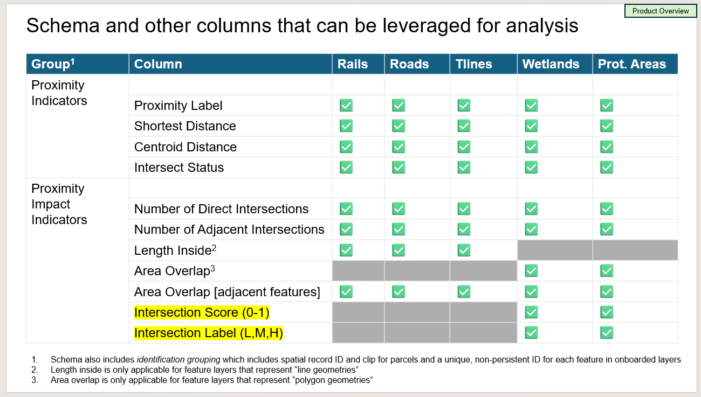
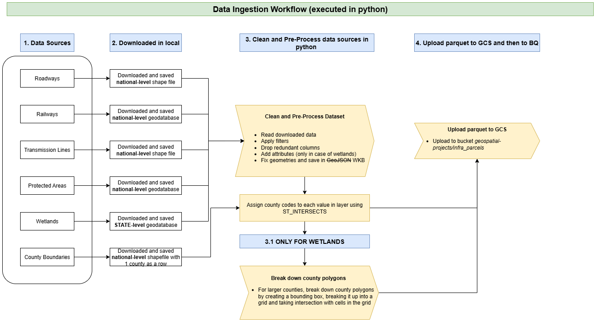
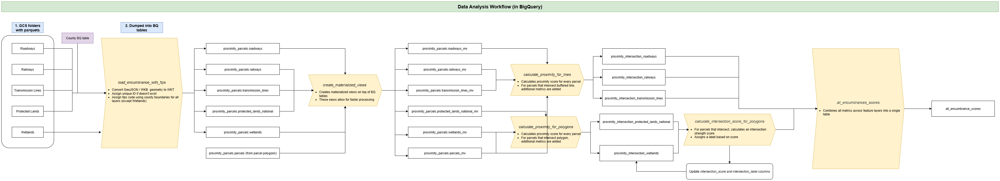

# Proximity-Parcels
### Description updated on: Sep 29, 2025
Sample map for testing/exploring data [in CARTO](https://clausa.app.carto.com/viewer/2af35209-5a50-4e3d-9d5f-a0ed11b30804). Click on the pink colored parcels to explore attribute values.

### Summary
**Product Vision**

Empower customers to achieve more in less time. More specifically, help them in identification of zones of interest by applying the concept of proximity on strategically relevant infrastructure and environmental layers of interest. 
*Go beyond what and where is the parcel… to what is near the parcel.* 

**Product Description**

Proximity Parcels (v1.0) is a Location Intelligence bulk data product that can be leveraged to obtain proximity insights with respect to five feature layers – Roadways, Railway Lines, Transmission Lines, Protected Areas and Wetlands – for every parcel in the United States. 

Proximity indicators and impact metrics are calculated for each feature layer separately, and are available as a grouping(s). Along with these values, we also provide entity metadata for feature values. Customers can obtain one or more of these groupings based on their needs.

### Attribution Provided
Out of the five features mentioned above, the first three are line geometries while the last two are polygons. While proximity metrics are calculated for all five, impact metrics vary based on whether a feature is a line or a polygon. Here is a breakdown:



### Underlying Workflow
**Ingestion:**


**Analysis:**


**Stored Procedures are in *nation_wide_bq/procedures***. For the E2E workflow, they need to be run in the following order:
1. create_materialized_views.sql
2. proximity_score_lines.sql
3. proximity_score_polygons.sql
4. intersection_score_polygons.sql
5. all_encumbrance_scores.sql

### Lower-Level Details:
**THESE SHOULD NOT BE SHARED OUTSIDE COTALITY WITHOUT CONSULTING SCIENCE / PRODUCT TEAM MEMBERS.**

Proximity thresholds are defined separately for line and polygon geometries. Since this is a bulk product, these can't be changed. The current thresholds are:

* For **major highways, railways and transmission lines**:
    | Distance (metres) | Label |
    | ----------------- | ------- |
    | 5    | Intersects |
    | 150  | Very High  | # Anything more than 5 metres upto 150 metres will be classified 'very high' proximity
    | 300  | High       |
    | 750  | Medium     |
    | 1000 | Low        |
    | >1000| Beyond Threshold | 

* For **wetlands and protected lands**, we don't need to apply a buffer in the base case *intersects*:
    | Distance (metres) | Label |
    | ----------------- | ------- |
    | 0   | Intersects |
    | 10  | Very High  |             
    | 25  | High       |
    | 75  | Medium     |
    | 150 | Low        |
    | >150| Beyond Threshold |

* Intersection strength is calculated using three metrics: *intersected geometry area as a percentage of parcel area*, *distance of parcel centroid from nearest edge of intersected feature* and *number of intersections*. These are mentioned in descending order of their contribution to the intersection score. Weights and thresholds are static, and can be tweaked with a minor change in code. The strength calculation uses a simple **weighted scoring approach** like so:
    ```
    S_final = (S_ar * W_ar) + (S_dist * W_dist) + (S_nint * W_nint)
    Where:
        * S_final = Final weighted score
        * S_ar = Score related to the area ratio
        * W_ar = Weight of the area ratio score
        * S_dist = Score related to the distance
        * W_dist = Weight of the distance score
        * S_nint = Score related to the number of intersections
        * W_nint = Weight of the number of intersections score
    ```
    **Intersection score, calculated through this equation could be *high* (>0.7), *medium* (0.35-0.7) or *low* (0-0.35).**
    The underlying weights and thresholds to calculate the score can be shared upon request. However, we don't anticipate a situation in which these weights and thresholds would be needed. 


### Data Sources:
We're using the following 5 features in the POC:
1. **Major Roadways:** Sourced from [US DOT Bureau of Transportation Statistics' North American Roads Data](https://geodata.bts.gov/datasets/usdot::north-american-roads/about)
2. **Railways:** Sourced from [US DOT Bureau of Transportation Statistics' North American Rail Network Lines](https://geodata.bts.gov/datasets/usdot::north-american-rail-network-lines/about)
3. **Transmission Lines:** Sourced from ~~[Department of Homeland Security's HIFLD Database](https://hifld-geoplatform.hub.arcgis.com/datasets/geoplatform::transmission-lines-1/about)~~. As of Sep 2025, HomeLand Security operates a GII portal which has this data. Access to GII portal requires a login ID and password. Cotality Legal and Data Sourcing teams are working towards creating these authentication combinations.
4. **Wetlands:** Sourced from [US Department of Fisheries and Wildlife Services](https://www.fws.gov/program/national-wetlands-inventory/download-state-wetlands-data)
5. **Protected Areas:** Sourced from [US Geological Survey](https://www.sciencebase.gov/catalog/item/6759abcfd34edfeb8710a004) 